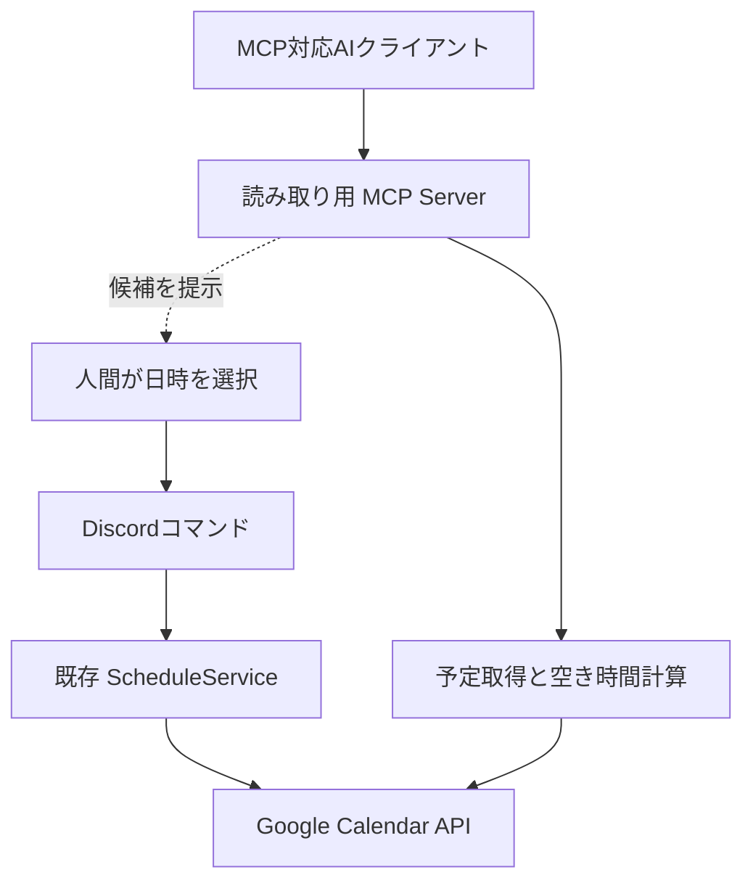

# MCP導入：Before / After 学習ガイド

## 今回の設計原則

**AIは判断材料を整理する。人間の都合・優先順位・例外・最終決定は人間が扱う。**

MCPは接続規格であり、AIエージェントそのものではありません。このブランチは
MCPサーバーの追加です。Discordの自然言語チャットをAI化したものではありません。

## Before：元の main

基準コミット：`1c94be57f748256821138e7f0de71fc65975f729`

人間がDiscordの `/schedule-add` で対象・日時を指定し、
`ScheduleService.create()` が既存のOAuthトークンを使ってGoogle Calendarに登録します。
`/schedule-delete` は作成者または管理者が実行します。

確認した時点では、予定参照・空き時間検索・特定メンバーへのリマインドは未実装でした。
他人への登録は既存機能ですが、本人の個別承認を求めるフローはありません。

## After：別の読み取り入口を追加



| 比較 | Before | After |
|---|---|---|
| 操作入口 | Discordスラッシュコマンド | Discord＋独立したローカルMCP入口 |
| 登録・削除 | 人間がDiscordから指示 | 同じ。MCPには書き込みToolなし |
| 予定参照 | なし | 自分の指定カレンダーの埋まっている時間帯 |
| 空き時間 | 人間が確認 | コードが条件に合う空き区間を日時順に返す |
| 日時の決定 | 人間 | 人間 |
| 他人の参照 | なし | 未公開。本人の共有許可の設計が必要 |
| 通知・交渉 | 自動リマインドなし | 今回も追加なし |
| OAuth | 各メンバーが連携 | 既存の連携・暗号化トークンを再利用 |

### 担当の境界

| 担当 | 行うこと |
|---|---|
| AIクライアント | 人間が指定した条件を引数にしてToolを呼び、結果を整理 |
| コード | 日時検証、固定された自分のIDに対する参照、空き区間計算 |
| 人間 | 検索範囲の指定、候補の選択、相手との調整、Discordで確定 |

`get_schedule(start_at, end_at)` はタイトル・説明・メール・トークンを返しません。
`find_available_time(start_at, end_at, duration_minutes)` は必要な長さ以上の
**空き区間**をすべて日時順に返します。予約時刻の選定・ランキングはしません。
例えば21〜23時の空き区間は「21時に予約せよ」という意味ではありません。

空いているのは指定した1つのカレンダー上だけです。本人が実際に対応可能か、
他のカレンダーや私生活の都合があるかは推測できません。

## 1. GoogleなしでMCPを体験

このブランチでCodespacesを作成します。既存Codespacesなら：

```bash
git fetch origin
git switch feat/mcp-readonly-learning
pip install -r requirements-dev.txt
python scripts/mcp_demo.py
```

デモはMCPクライアントがstdioでサーバーを起動し、初期化→ツール一覧取得→呼び出しを実行します。
10月8日20〜21時を架空の予定として返すため、検索を19〜23時・所要60分にすると
`19〜20時` と `21〜23時` が返ります。Google・Discord・LLMへの接続やAPIキーは不要です。

読む順番：

1. `scripts/mcp_demo.py`：クライアントが何を送るか
2. `app/mcp/server.py`：Python関数をToolとして公開する部分
3. `app/services/availability_service.py`：AIを使わない空き時間計算
4. `app/google/calendar.py`：既存API連携への読み取り追加
5. `tests/test_mcp.py`：実際のMCP通信を使った検証

MCP Inspectorなどstdioに対応するクライアントでは、リポジトリを作業ディレクトリにし、
コマンド `python`、引数 `-m app.mcp.server --demo` を設定すると同じToolを試せます。
サーバー単独の `python -m app.mcp.server --demo` はMCP入力を待つので、
通常の対話型CLIのような表示はしません。

## 2. 自分の実カレンダーへ接続

1. READMEの既存手順で `.env` を設定し、Discord Botを起動。
2. 自分が `/calendar-link` を実行。
3. `.env` に `MCP_DISCORD_USER_ID=自分のDiscordユーザーID` を追加。
4. 同じリポジトリ・DBを使うローカルMCPクライアントから、
   `python -m app.mcp.server` を起動（`--demo` は外す）。
5. ISO 8601のオフセット付き日時でToolを呼び、候補を確認。
6. 人間が選んだ日時を既存Discordコマンドで登録。

MCPの検索期間は最大31日、所要時間は1〜1440分。
Google APIのページ送り・繰り返し予定の展開・終日予定・透明な予定を扱います。
途中で取得に失敗したら空き候補を返さずエラーにします。
Googleのアクセストークン更新時だけDBへ保存します。カレンダーの予定は変更しません。

## 読み取り権限の範囲と制約

- 今回は**自分専用のローカルstdio実験**。HTTPの公開エンドポイントは作りません。
- 所有者IDはサーバー起動環境で固定。AIが引数で他人のIDを指定することはできません。
- これは多人数サービス向けの利用者認証ではありません。PCや設定を操作できる人はIDを変更できます。
- `.env` のIDには自分自身だけを設定してください。他人のトークンを利用する実験は対象外です。
- 既存OAuthの `calendar.events` は読み取り専用scopeではありません。
  **MCPに公開する操作を読み取りだけに制限**しているのであって、トークン自体の書き込み権限を減らしたわけではありません。
- 本番で複数人に提供する際は、利用者認証・本人の参照許可・サーバー境界を別途実装する必要があります。
- AIホストへの接続・AIによる自然言語解釈はこの環境では検証していません。
  デモは実MCP通信であり、LLMを使った会話デモではありません。

## SDKの選択

学習用に公式Python SDKのFastMCP v1 APIを利用し、`mcp>=1.28,<2` に範囲を固定しました。
検証環境は `mcp 1.30.0` です。v2移行は別のAPI変更として比較できるように分離します。
v1 APIの公式資料：[MCP Python SDK v1](https://py.sdk.modelcontextprotocol.io/v1/)。

## 差分の見方

```bash
git diff 1c94be57f748256821138e7f0de71fc65975f729..feat/mcp-readonly-learning -- app/mcp app/services/availability_service.py app/google/calendar.py
pytest -q
```

既存の `ScheduleService.create/delete` やDiscordコマンドをMCPへ置き換えず、
新しい入口を足す部分に注目してください。
